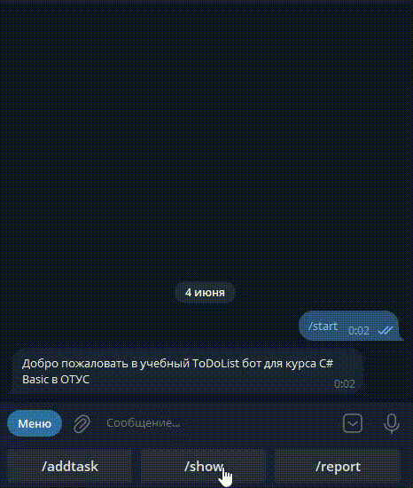
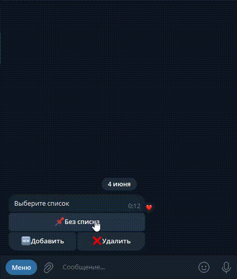

### Цель
    
Расширение функционала приложения, разработанного в предыдущих домашних заданиях:

- Изменение вывода информации о задаче
- Добавление сценария удаления задачи
- Добавление просмотра выполненных задач
- Практики по LINQ
- Добавление постраничной навигации при выводе задач

---

### Описание

Ссылка на [GitHub](https://github.com/OTUS-NET/C-Sharp-Basic/blob/main/Homeworks/12%20%D0%9F%D0%BE%D1%81%D1%82%D1%80%D0%B0%D0%BD%D0%B8%D1%87%D0%BD%D0%B0%D1%8F%20%D0%BD%D0%B0%D0%B2%D0%B8%D0%B3%D0%B0%D1%86%D0%B8%D1%8F/Task.md)

Перед выполнением нужно ознакомится с [Правила отправки домашнего задания на проверку](https://github.com/OTUS-NET/C-Sharp-Basic/blob/main/Homeworks/README.md)

Демонстрация работы постраничной навигации

Демонстрация работы просмотра выполненных задач

1. Изменение вывода информации о задачах. Добавление кнопок для выполнения и удаления задач
    - Добавить метод в интерфейс `IToDoService`
        - Task<ToDoItem?> Get(Guid toDoItemId, CancellationToken ct);
    - Добавить класс `ToDoItemCallbackDto`. Наследовать от CallbackDto. Реализовать аналогично `ToDoListCallbackDto`
            Свойства:
                -  Guid ToDoItemId
            Методы:
                - public static new ToDoItemCallbackDto FromString(string input)
                - public override string ToString()
    - При обрботке команды Action = "show" (через Inline кнопки) добавить в кнопки с задачами в callbackData ToDoItemCallbackDto.ToString(). Action = "showtask", ToDoItemId = Id
    - В метод `OnCallbackQuery` добавить обработку
        - ЕСЛИ Action равен
            - "showtask" TO получить `ToDoItemCallbackDto` и вернуть информацию о задаче с Inline кнопками:
                - "✅Выполнить" в callbackData пишем ToDoItemCallbackDto.ToString(). Action = "completetask", ToDoItemId = Id
                - "❌Удалить" в callbackData пишем ToDoItemCallbackDto.ToString(). Action = "deletetask", ToDoItemId = Id
    - Добавить обработку Action = "completetask" и Action = "deletetask" в метод `OnCallbackQuery`
    - Удалить обработку текстовых команд /completetask и /removetask
2. Создание метода расширения LINQ для пагинации
    - Создать статический класс `EnumerableExtension` в папке Helpers
    - Реализовать метод расширения `GetBatchByNumber` для IEnumerable<TSource>
    - Метод должен принимать 
        - int batchSize //размер пачки
        - int batchNumber //номер возвращаемой пачки, нумерация с 0 
    - Метод должен возвращать подмножество элементов из последовательности IEnumerable<TSource>, основываясь на размере партии и её номере.
    - Пример: [1, 2, 3, 4, 5, 6, 7, 8, 9, 10] для batchSize = 3 и batchNumber = 1 результат будет [4, 5, 6]
3. Реализация пагинации
    - Добавить класс `PagedListCallbackDto`. Наследовать от `ToDoListCallbackDto`.
            Свойства:
                - int Page 
            Методы:
                - public static new PagedListCallbackDto FromString(string input)
                - public override string ToString() - Возвращает $"{base.ToString()}|{Page}"
    - Перейти на использовать `PagedListCallbackDto` вместо `ToDoListCallbackDto` при обработке команд Action = "show". Пока Page = 0.
    - Добавить приватное статическое поле int _pageSize = 5; в `UpdateHandler`. Оно отвечает за количество кнопок на одной странице
    - Создать приватный метод `BuildPagedButtons` в `UpdateHandler`. 
        - Возвращает `InlineKeyboardMarkup`
        - Аргументы:
            - IReadOnlyList<KeyValuePair<string, string>> callbackData - общий набор кнопок. Ключ - имя кнопки, Значение - callbackData
            - PagedListCallbackDto listDto
        - Логика:
            - Расчитать общее количество страниц.
            - Создать InlineKeyboardMarkup и добавить кнопки относящие только к конкретной странице с помощью GetBatchByNumber(_pageSize, listDto.Page)
            - Если listDto.Page > 0 то добавить кнопку ⬅️ с PagedListCallbackDto(listDto.Action, listDto.ToDoListId, page - 1)
            - Если listDto.Page < totalPages - 1 то добавить кнопку ➡️ с PagedListCallbackDto(listDto.Action, listDto.ToDoListId, page + 1)
    - Использовать метод `BuildPagedButtons` при обработке Action = "show"
    - При при переключении между страницами и переходе от списка к задачам долдно присылаться не новое сообщение, а изменяться текущее. Это можно реализовать с помощью метода `bot.EditMessageText`. См. демонстрацию
4. Добавление просмотра выполненных задач
    - При обработке команды Action = "show" добавить вывод кнопки "☑️Посмотреть выполненные" с PagedListCallbackDto("show_completed", ToDoListId, 0)
    - Добавить обработку команды Action = "show_completed" в метод `OnCallbackQuery`. Должна поддерживаться пагинация
    - Если задач нет, то выводить сообщение "Задач нет"
5. Добавление сценария `DeleteTaskScenario`
    - Добавить `DeleteTask` в `ScenarioType`
    - Добавить класс `DeleteTaskScenario`, который реализует интерфейс `IScenario` и в конструкторе принимает `IToDoService`
    - Реализовать аналогично `DeleteListScenario`. Должно быть подтверждение у пользователя при удалении (см. Демонстрацию)
    - При нажатии на кнопку "❌Удалить" c Action = "deletetask" должен запускаться сценарий `DeleteTaskScenario`
6. (Опционально) Пройтись по проекту и добавить использование LINQ там, где это возможно
7. Обновить /help и bot.SetMyCommands

---

### Критерии оценивания

- Пункт 1 - 2 балла
- Пункт 2 - 2 балла
- Пункт 3 - 2 балла
- Пункт 4 - 2 балла
- Пункт 5 - 1 балл
- Пункты 6-7 - 1 балл

Для зачёта домашнего задания достаточно 8 баллов.